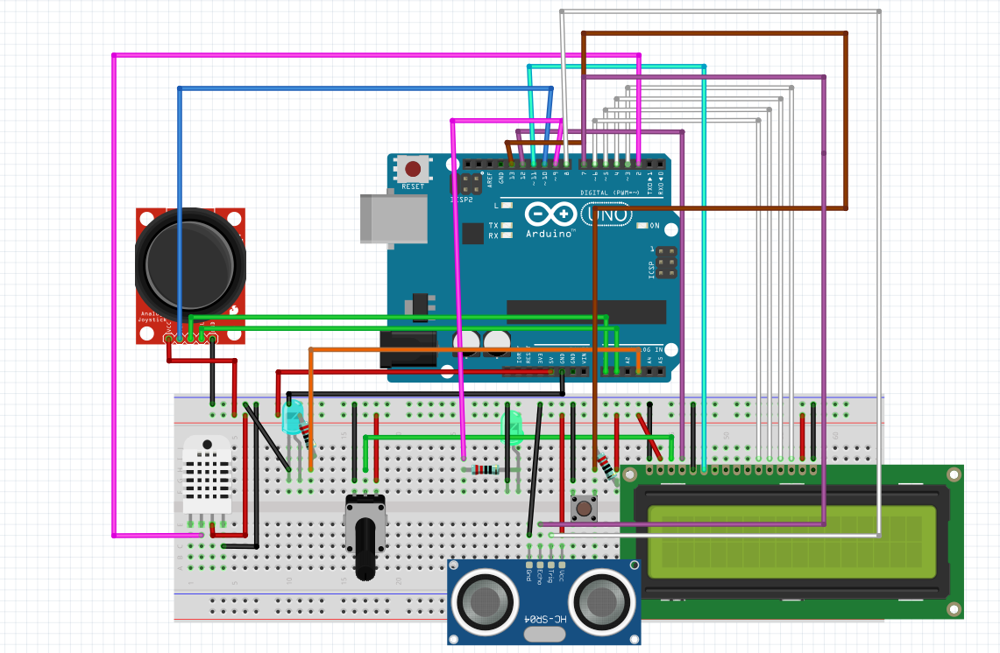

# Coffee Machine Project

This project is a coffee machine simulation implemented using an Arduino board and various sensors and actuators. The coffee machine allows users to select different types of coffee, adjust the price of each coffee, and provides an administration mode for monitoring temperature, humidity, and distance using an LCD display.


https://github.com/jfisher2021/practicas_empotrados/assets/113594937/2e179a7b-7ba2-4725-b177-0df30b2b1448


## Table of Contents

● BLOG

● Components

● Installation

● Usage

● CODE


## BLOG 

Today we are going to see how to make a vending machine with Arduino. This project is a coffee machine simulation implemented using an Arduino board and various sensors and actuators. The coffee machine allows users to select different types of coffee, adjust the price of each coffee, and provides an administration mode for monitoring temperature, humidity, and distance using an LCD display. Let me show you how I did it. It was a bit difficult but I learned a lot and i had fun doing it. 

I hope you enjoy it and maybe you can do it yourself at home ;). 

Here is the fritzing diagram of the project in case you want to do it yourself.

you can download the fritzing file here:

[fritzing maquina expendedora ](maquina_expendedora.fzz)



## Components

The following components are used in this project:

● Arduino UNO 🚀

● LCD 🖥️

● Joystick 🕹️

● Sensor temperatura/Humedad (DHT11) 🌡️

● Sensor Ultrasonido 📏

● Boton 🎮

● 2 LEDS Normales (LED1, LED2) 💡


## Installation

To set up the coffee machine project, follow these steps:

Connect the Arduino board to your computer.

Libraries Used:

● LiquidCrystal: https://www.arduino.cc/en/Reference/LiquidCrystal

● ArduinoThread: https://www.arduino.cc/reference/en/libraries/arduinothread/

● Watch Dog: https://create.arduino.cc/projecthub/rafitc/what-is-watchdog-timer-fffe20

● DHT-sensor-library: https://github.com/adafruit/DHT-sensor-library

● TimerOne: https://www.arduino.cc/reference/en/libraries/timerone/

Upload the code provided in this repository to the Arduino board.


## CODE

At first I started playing with a led and the lcd display to see how they worked. I had to visit the Arduino page to learn how to conect the pins. Once I learned to dispaly the information on the lcd display I started to work with the joystick. I had to learn how to read the values of the joystick and how to use them to move the cursor on the lcd display. I had to use de analog Pins to read the values of the joystick so instead of using the digitalWrite() function I had to use the analogRead() function. The map() function in Arduino is used to re-map a number from one range to another. In my case i use it to convert the 1024 values of the joystick to the 180 degrees of the servo motor.

```c++

    // include the library code:
    #include <LiquidCrystal.h>
    /*

    The circuit:

    - LCD RS pin to digital pin 12
    - LCD Enable pin to digital pin 11
    - LCD D4 pin to digital pin 5
    - LCD D5 pin to digital pin 4
    - LCD D6 pin to digital pin 3
    - LCD D7 pin to digital pin 2
    - LCD R/W pin to ground
    - LCD VSS pin to ground
    - LCD VCC pin to 5V
    - 10K resistor:
    - ends to +5V and ground
    - wiper to LCD VO pin (pin 3)
    */

    #define PIN_VRx A0 // Pin analógico 0 para el eje X del joystick
    #define PIN_VRy A1 // Pin analógico 1 para el eje Y del joystick
    #define PIN_SW 10 // Pin digital 10 para el botón
    #define PIN_LED A3 // Pin analógico 3 para el LED
    const int rs = 12, en = 11, d4 = 6, d5 = 5, d6 = 4, d7 = 3;
    LiquidCrystal lcd(rs, en, d4, d5, d6, d7);
    void setup() {
        pinMode(PIN_SW, INPUT_PULLUP);
    }

    void loop() {
        int x = analogRead(PIN_VRx);
        int y = analogRead(PIN_VRy);
        x_ang = map(x, 0, 1023, 0, 180);
        y_ang = map(y, 0, 1023, 0, 180);
        int sw = digitalRead(PIN_SW);
        lcd.setCursor(0, 0);
        lcd.print("X: ");
        lcd.print(x_ang);
        lcd.setCursor(0, 1);
        lcd.print("Y: ");
        lcd.print(y_ang);
    }

```

The next step was to conect the ultra sonic sensor and the Temperature and Humidity sensor. I learned how to use the libraries for each sensor and how to read the values. After almost burning the DHT11 I figured out how to put the cable un the correct position. After understanding and controlling moreless the sensors, the fun part started, PROGRAMING.

I started by creating the STATES

```c++

// --------------------------------- STATES ---------------------------------
enum State {
    START,
    SERVICE,
    LET_HIM_COOK,
    PRESIO,
    ADMIN,
    ADMIN_OPTIONS
};

```

### LITTLE MISSIONS

##### 1. Detect Human Presence

It was simple, I just had to read the value of the ultrasonic sensor and if the value was less than 100cm I would call service().

```c++

     if (sensor_distancia() > 100) {
        lcd.clear();
        lcd.setCursor(0, 0);
        lcd.write("   ESPERANDO    ");
        lcd.setCursor(0, 1);
        lcd.write("    CLIENTE     ");
        previousMillis_ = millis();
        temp_hum = millis();
    } else {
        servicio();
    }

```

##### 2. Service

The service() function was easy but I had to learn how to use the millis() function to create a timer. I used the millis() function to create a timer of 5 seconds to display the temperature and humidity on the lcd display. After 5 seconds the display would show the menu.

```c++

    static int product = 0;
    unsigned long currentMillis = millis();
    if ((millis() - temp_hum) < 5000) {
        if ((millis() - previousMillis) > interval) {
            lcd.clear();
            lcd.setCursor(0, 0);
            lcd.write("Temp: ");
            lcd.print(temperatura);
            lcd.print((char)223);
            lcd.write("C");
            lcd.setCursor(0, 1);
            lcd.write("Hum: ");
            lcd.print(humedad);
            lcd.write("%");
            previousMillis = millis();
        }
        previousMillis = millis();
    }

```
The menu had to move if the user moved the joystick so i created a vaiable called product , if the joistic x imore than 110 the product sums 1, if the joystick x is less than 70 the product substracts 1. As i only had 5 products i had to make sure that the product variable was between 0 and 4.

```c++

if (x_ang > 110) {
    product++;
    if (product > 4) {
        product = 0;
    }
} else if (x_ang < 70) {
    product--;
    if (product < 0) {
        product = 4;
    }
}

```

##### 3. Let him cook

This state was one of the most challenging as we had to light the led incrementally. We also had to vrate a random number between 4 and 8 to simulate the time it takes to make the coffee. I used the map function to convert the random number to the 0,255 analog value to the LED. Also i had to compare it aevery time with millis to see how much time was left to increrase the ligth. 

```c++
if (millis() - startTime_coffe < listo_pa) {
        lcd.setCursor(0, 0);
        lcd.print("PREPARANDO");
        lcd.setCursor(0, 1);
        lcd.print("CAFE");
        int progress = map(millis() - startTime_coffe, 0, listo_pa, 0, 255);
        analogValue = map(progress, 0, 255, 0, 255);
        analogWrite(PIN_LED2, analogValue);
        removeDrinkTime = millis();

```

##### 4. ADMIN

admin function

The admin function handles the ADMIN state of the system. Depending on the selected option, it displays information such as temperature, sensor distance, usage time, or allows for changing product prices. It also includes the transition to the PRICE state if the option to modify prices is selected.

```cpp

void admin(int option_) {
    int option = option_;

    if (y_ang < 70) {
        state = ADMIN;
    }

    if (millis() - previousMillis >= interval) {
        previousMillis = millis();
        lcd.clear();

        switch (option) {
            case 0:
                // Muestra temperatura y humedad
                // ...
                break;
            case 1:
                // Muestra distancia del sensor
                // ...
                break;
            case 2:
                // Muestra tiempo de uso
                // ...
                break;
            case 3:
                // Cambia al estado PRESIO para modificar precios
                state = PRESIO;
                y_ang = 0;
                break;
            default:
                break;
        }
    }
}
```
Function change_price

The change_price function allows modifying the prices of the products. It uses static variables to maintain the state and control the logic of price change. It also manages the real-time update of prices and the confirmation of the change.

Price Modification Logic:

I have used joystick reading to determine whether the user wants to increase or decrease the price of the selected product (product_modificar).
The price increment or decrement (cambiar_presio) is based on the position of the joystick.

```cpp

if (x_ang > 110) {
    cambiar_presio += 0.05;
} else if (x_ang < 70) {
    cambiar_presio -= 0.05;
}
```
Confirmation and Application of Changes:

I implemented a mechanism to confirm the price modification by requiring the user to hold down the button (sw_pulsado).
When the confirmation is made (ONETHER_ONE is true), I updated the original prices with the new values.

```cpp

if (ONETHER_ONE) {
    if (sw_pulsado == LOW) {
        switch (valor) {
            case 0:
                cafe_solo = nuevo_cafe_solo;
                break;
            case 1:
                cafe_cortado = nuevo_cafe_cortado;
                break;
            // ... (otros productos)
            default:
                break;
        }
    }
}
```
##### 5. Count Button Press Duration

The tiempo_pulsado_boton function monitors the duration of a button press and performs the following actions based on the press duration:

Button Press Detection:
    Records the start time when the button is pressed (LOW state).

Button Release Detection:
    Calculates the pressed time duration only if the button has been released (HIGH state).
    Resets the button press start time.

Actions Based on Press Duration:
    If the button is pressed for more than 2 seconds but less than or equal to 3 seconds, transitions to the SERVICE state.
    If the button is pressed for more than 5 seconds, toggles between ADMIN and SERVICE states.
    Resets relevant timers (previousMillis_ and temp_hum).
```cpp
    void tiempo_pulsado_boton() {
    static unsigned long buttonPressStartTime = 0;
    static unsigned long tiempo_pulsado = 0;
    if (digitalRead(BOTON) == LOW) {
        if (buttonPressStartTime == 0) {
            // Si el botón acaba de ser presionado, registra el tiempo actual
            buttonPressStartTime = millis();
        }
    } else {
        if (buttonPressStartTime > 0) {
            // Calcula el tiempo pulsado solo si el botón ha sido soltado
            tiempo_pulsado = millis() - buttonPressStartTime;
            buttonPressStartTime = 0;  // Reinicia el tiempo de inicio
        }
    }

    if (tiempo_pulsado >= 2000 && tiempo_pulsado <= 3000) {
        // Si el botón ha estado presionado durante más de 2 segundos y menos de 3 segundos, cambia al estado SERVICE
        previousMillis_ = millis();
        temp_hum = millis();

        tiempo_pulsado = 0;
    }
    if (tiempo_pulsado > 5000) {
        // Si el botón ha estado presionado durante más de 5 segundos, cambia al estado ADMIN
        lcd.clear();
        digitalWrite(PIN_LED, LOW);
        analogWrite(PIN_LED2, 0);
        state = (state == ADMIN) ? SERVICE : ADMIN;
        temp_hum = millis();
        previousMillis_ = millis();

        tiempo_pulsado = 0;
    }
}
```

##### 6. Threads of Buttons and Joystick

Thread and Controller Definition:

An instance of ThreadController called controller is created to manage the threads.
An object of LedThread called parpadeo is created to handle the blinking of an LED.

```cpp
ThreadController controller = ThreadController();
LedThread *parpadeo = new LedThread(PIN_LED);
```
Once the controller is created, the threads are added to it. This is an example of how to add the joystick thread to the controller. But i created a thread for the button and onether one for the joystick.

```cpp
joistick_thread.enabled = true;
joistick_thread.setInterval(100);
joistick_thread.onRun(leer_joistick);
controller.add(&joistick_thread);
```

##### 7. Watchdog

Finally, I implemented a watchdog timer to reset the Arduino board if the system hangs. The watchdog timer is a hardware timer that automatically resets the microcontroller if the main program fails to reset it. As my code had no While or delay I put the watchdog timer to 8 seconds, and the reset time on the loop function 
```cpp
void setup() {
    // Inicializamos el watchdog timer
    wdt_disable();        // Deshabilitamos el watchdog timer
    wdt_enable(WDTO_8S);  // Habilitamos el watchdog timer con un tiempo de espera de 8 segundos

}
void loop() {
    // all code here
    wdt_reset();
}
```


